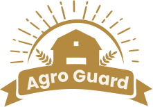

<h1 align="center"> Agro Guard </h1>
<h2 align="center">Aplicação cujo objetivo é auxiliar os produtores na sua plantação, disponibilizando dados da temperatura e umidade.</h2>

## 🎯 Objetivo

 Repositório principal do projeto AgroGuard, esse que é o P.I. do 4º Semestre do curso de Desenvolvimento de Software Multiplaforma da FATEC Franca. 

## 💻 Projeto

O projeto consiste numa aplicação mobile e web, que disponibiliza os dados de temperatura e umidade coletados a partir de uma aplicação IOT, com o objetivo pricipal de ajudar os pequenos produtores a aumentarem sua produção, terem melhor qualidade do seu produto e principalmente reduzirem seus prejuízos por decorrência do clima/tempo.

 

### 🔗 Links:
<a href="https://github.com/LucasTKP/2co">Front-End</a> 
<a href="https://github.com/GuihCFerreira/PI--BackEnd"> Back-End</a> 
<a href="https://github.com/GuihCFerreira/PI-IOT"> Projeto IOT</a> 
<a href="https://github.com/GuihCFerreira/PI-Mobile"> Mobile</a> 
<a href="https://github.com/GuihCFerreira/PI---BackEnd---Documentation"> Documentação API</a> 
<a href="https://github.com/LucasTKP/dashboard-pi-quarto-semestre"> Dashboard</a> 
<a href="https://www.figma.com/design/YRerY9lZ9E2nNd5aTeddyp/Pi-4-Semestre?node-id=0-1&t=ORpki0PWvVe2MfCy-0">Figma</a> 
<a href="https://youtu.be/zkxGZEQU-gM">Vídeo - Youtube</a> 

## Desenvolvido

Todo o projeto foi desenvolvido pelos alunos:  

Cayk Andrade Magnani, Guilherme de Carvalho Ferreira e  Lucas Gean dos Santos.
 
